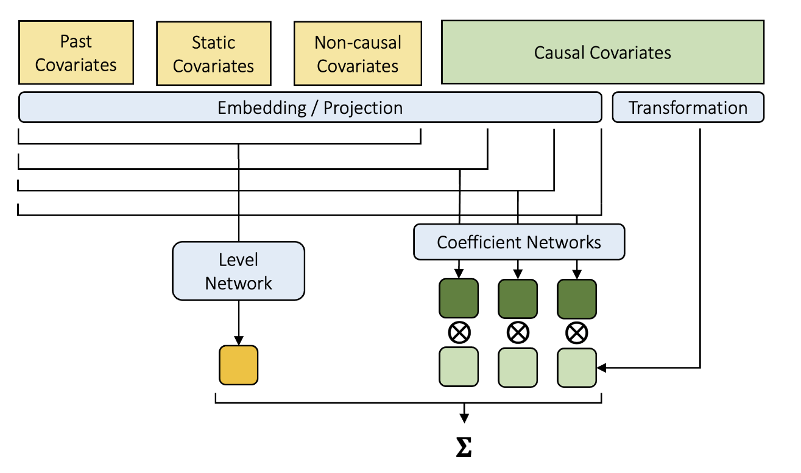

# Hierarchical Neural Additive Models for Interpretable Demand Forecasts (Journal of Forecasting 2025)

본 문서는 시계열 예측을 위해 제안된 `HNAM` (Hierarchical Neural Additive Models) 모델의 핵심 방법론과 기여를 분석 및 요약합니다. (Paper: https://arxiv.org/pdf/2404.04070#page=27.16)

---
## 1. Introduction

**어떤 문제를 해결하려 하는가?**

수요 예측(Demand Forecasting) 분야에는 오래된 딜레마가 있습니다.

1. **전통적 통계 모델 (e.g., ARIMA, Prophet)**: 모델이 왜 이런 예측을 했는지 이해하기 쉽습니다 (Interpretable). 하지만 복잡한 데이터 패턴이나 여러 변수 간의 관계를 학습하는 데 한계가 있습니다.
2. **딥러닝 모델 (e.g., TFT, DeepAR)**: 정확도가 매우 높습니다. 하지만 모델 내부가 너무 복잡해서 왜 이런 예측 값이 나왔는지 알 수 없는 '블랙박스(Black Box)'입니다.

현업 실무자들은 '이유를 모르는' 예측값은 신뢰하지 않고, 결국 모델을 사용하지 않게 되는 경향이 있습니다. 이를 **Algorithm Aversion**이라고 부릅니다.

**HNAM의 제안:**
이 논문은 **HNAM (Hierarchical Neural Additive Models)**을 제안합니다. 이 모델의 목표는 딥러닝의 강력한 예측 성능(Accuracy)과 통계 모델의 명확한 설명력(Interpretability)을 모두 달성하는 것입니다.

핵심 아이디어는 예측을 **Level (기본 수요)** 와 **개별 변수들의 효과**의 합으로 분해하는 것입니다.

가장 큰 특징은 이 '변수들의 효과'가 서로 상호작용할 수 있는데, **사용자가 지정한 계층(Hierarchy) 구조**를 따른다는 점입니다.

> [예시] 계층 구조란?
> 
> 
> 만약 우리가 `[Weekday → Promotion → Holiday]` 순서로 계층을 설정했다면, 모델은 다음과 같이 효과를 계산합니다.
> 
> - `Weekday` (요일) 효과: 다른 변수에 영향받지 않고 독립적으로 계산됩니다.
> - `Promotion` (프로모션) 효과: `Weekday`에 따라 달라질 수 있습니다. (e.g., '주말 프로모션' 효과와 '주중 프로모션' 효과를 다르게 학습)
> - `Holiday` (휴일) 효과: `Weekday`와 `Promotion` 모두에 따라 달라질 수 있습니다. (e.g., '프로모션이 겹친 주말 휴일'의 효과를 학습)

---
## 2. Motivation and Methodological Background

### Motivation

HNAM의 핵심 동기는 **Cognitive Compatibility (인지적 호환성)**입니다.

실제 현업 담당자들은 예측을 할 때 '이번 주 기본 판매량은 100개인데, 프로모션이 있으니 +30개, 날씨가 더우니 +10개'처럼, 기준점에 여러 효과를 더하고 빼는 방식(Additive)으로 사고하는 경향이 있습니다.

HNAM은 의도적으로 이 사고방식과 동일한 **Additive Output 구조**를 가집니다. 이를 통해 실무자가 모델의 예측 결과를 더 쉽게 신뢰하고 받아들일 수 있도록 유도합니다.

### Methodological Background

HNAM은 다음 모델들의 아이디어에 기반합니다.

#### **Prophet**
Prophet은 다음과 같은 명시적인 Additive 모델입니다.
$$y(t) = g(t) + s(t) + h(t) + e(t)$$
 - $g(t)$: 트렌드 (e.g., piecewise-linear)
 - $s(t)$: 계절성 (e.g., daily, weekly)
 - $h(t)$: 공휴일 및 추가 변수 효과
 - $e(t)$: 오차항 (한계: 해석은 쉽지만, 변수 간 복잡한 비선형 상호작용을 잡기 어렵고, 시계열마다 따로 학습해야 합니다.)

#### **Neural Additive Models (NAMs)**
Prophet의 아이디어를 딥러닝으로 확장한 모델입니다. 각 변수(Feature)마다 독립적인 작은 신경망(NN)을 할당합니다.
$$f(x) = \sum_{i=1}^{d} f_{i}(x_{i})$$
 - $f_i$는 $i$번째 변수 $x_i$만을 입력으로 받는 작은 NN입니다. (한계: 각 변수의 비선형 효과는 볼 수 있지만, 변수 간의 '상호작용'은 모델링하지 못합니다.)

#### **Neural Additive Time Series Models (NATMs)**
NAMs를 시계열에 적용한 모델입니다. 모든 과거 시점과 모든 피처마다 NN을 사용하려다 보니 연산량이 매우 비효율적일 수 있고, TFT처럼 미래에 알려진 정보(Future Covariates)를 효과적으로 다루기 어렵습니다.

---
## 3. Proposed Architecture

HNAM은 예측값을 **'Level Network'**가 예측한 기본 수요와, 여러 **'Coefficient Networks'**가 예측한 변수별 효과의 합으로 구성합니다.

### 1. Covariates and Components

HNAM은 TFT와 유사하게 변수의 타입을 명확히 구분합니다.

- **Causal Covariates (**$C$**)**: 우리가 그 효과를 명시적으로 분리해서 보고 싶은 변수들입니다. (e.g., 프로모션, 공휴일, 가격). 이 변수들이 '계층 구조'를 가집니다.
- **Static Covariates (**$S$**)**: 시간에 따라 변하지 않는 변수 (e.g., 상품 카테고리, 매장 위치).
- **Non-causal Covariates (**$T$**)**: 미래까지 알려져 있지만, 그 효과를 따로 분리해 보지는 않는 변수 (e.g., 날짜 인덱스, 요일-Sine/Cosine 인코딩).
- **Past Covariates (**$P$**)**: 과거에만 알려진 변수 (e.g., 과거 판매량, 과거 유가).

HNAM의 최종 예측($y$)은 다음 수식으로 표현됩니다.

$$
y = g(S,T,P) + \sum_{i=0}^{n_{c}-1} f_{i}(S,T,P,C[:(i+1)]) \cdot t(C[i,T_{h}:])
$$

- $g(S,T,P)$: **Level Neural Network**입니다.
    - 오직 과거 정보($S$, $T$, $P$)만 보고 미래($T_h$)의 '기본 수요(Baseline)'를 예측합니다.
- $n_{c}$: Causal Covariates의 개수입니다.
- $f_{i}(S,T,P,C[:(i+1)])$: $i$**번째 Coefficient Neural Network**입니다.
    - 이 네트워크의 역할은 $i$번째 변수가 미래에 미칠 **영향력(Coefficient)**을 동적으로 계산하는 것입니다.
    - $C[:(i+1)]$: **'Hierarchy'의 핵심**으로 $i$번째 변수의 영향력을 계산할 때,  기본 정보($S$, $T$, $P$)뿐만 아니라, 계층상 **자신($i$)과 자신보다 낮은(lower) 변수들** (e.g., 0부터 $i$까지)의 정보를 함께 입력받습니다.
- $t(C[i,T_{h}:])$: $i$번째 Causal Covariate의 **실제 미래 값**입니다. (e.g., 프로모션 변수의 값이 0(안함) 또는 1(함)).
  - $t$: transformation function입니다. (원-핫 인코딩 & 표준화 수행)

> [예시] 수식의 이해
> 
> 1. Level Network($g$)가 "다음 주 기본 판매량은 [100, 105, 110...]"이라고 예측합니다.
> 2. 첫 번째 Causal 변수($i=0$)가 'Weekday'라고 가정합시다.
>     - $f_0$ (Weekday의 Coefficient Network)가 "월요일엔 -10, 화요일엔 -5..."의 영향력을 계산합니다.
>     - $t(C_0)$ (실제 미래 요일 값)과 곱해져 효과가 정해집니다.
> 3. 두 번째 Causal 변수($i=1$)가 'Promotion'이고 계층이 [Weekday $\rightarrow$ Promotion]이라고 가정합시다.
>     - $f_1$ (Promotion의 Coefficient Network)은 `C[:2]`, 즉 'Weekday' 정보와 'Promotion' 정보를 모두 입력받습니다.
>     - "만약 '주말(Weekday)'이고 '프로모션(Promotion)'이 1이면 영향력은 +50, '주중(Weekday)'이고 '프로모션(Promotion)'이 1이면 +20" 같은 동적 계수를 출력합니다.
>     - 이 값이 $t(C_1)$ (실제 프로모션 값 0 또는 1)과 곱해집니다.
> 4. 최종 예측 `y` = `g` (Level) + `Effect_0` (Weekday) + `Effect_1` (Promotion) + ...

### 2. Implementation

- Level Network($g$)와 Coefficient Network($f_i$)는 모두 **Multi-Head Attention**을 코어 메커니즘으로 사용합니다. (TFT의 Decoder와 유사한 구조)
- **Level Network (**$g$**):**
    - **Query**: 미래 시점의 Static(S) + Temporal(T) 정보
    - **Keys/Values**: 과거 시점의 Static(S) + Temporal(T) + Past(P) 정보
    - (의미: 과거의 모든 정보를 바탕으로 미래의 기본 수요 Level을 예측합니다.)
- **Coefficient Network (**$f_i$**):**
    - **Query**: 미래 시점의 (S + T + **C[:i+1]**) + **Level Embedding**
    - **Keys/Values**: 과거 시점의 (S + T + P + **C[:i+1]**)
    - (의미: 과거 정보와 **계층 정보**($C[:i+1]$)를 바탕으로, **기본 수요 Level**을 고려하여(Level Embedding 추가), $i$번째 변수의 미래 영향력(계수)을 예측합니다.)

### 4. Datasets and Preprocessing

- 3개의 실제 리테일(소매) 수요 데이터셋(Walmart, Favorita, **Retail**)을 사용했습니다.
- 이 중 'Retail' 데이터는 저자들의 산업 파트너(중견 소매업체)로부터 받은 비공개 실제 데이터입니다.
- **전처리**: 논문의 목적은 '해석가능성'을 검증하는 것이므로, 실무자들이 실제로 관리할 법한 데이터만 사용했습니다. 판매량이 0이 많거나(Intermittent), 판매량이 너무 적은 시계열은 **의도적으로 제외**하고, 안정적이고 판매량이 많은 상위 N개 품목들만 필터링해서 벤치마킹 환경을 구성했습니다.

### 5. Models

다음 모델들과 성능을 비교했습니다.

1. **HNAM (제안 모델)**: TFT처럼 데이터셋 전체로 하나의 모델을 학습하는 **Global Model**입니다.
2. **TFT**: SOTA 벤치마크. HNAM과 동일하게 **Global Model**로 학습합니다.
3. **Prophet, ETS, SARIMAX**: 전통적인 통계 벤치마크. 이 모델들은 각 시계열마다 별도의 모델을 학습하는 **Local Model**입니다.

(참고: HNAM의 계층은 모든 데이터셋에 `[Weekday, Relative Price, Promotion, Holiday]` 순서로 고정했습니다.)

### 6. Results

1. **예측 정확도**: HNAM은 SOTA Black-box 모델인 **TFT와 대등한(competitive) 예측 성능**을 보여주었습니다. (Walmart 데이터셋에서는 HNAM이, Favorita에서는 TFT가 약간 더 좋았고, Retail 데이터에서는 거의 비등했습니다.)
    - (의미: 해석가능성을 위해 구조적 제약을 걸었음에도, 예측 성능이 크게 떨어지지 않았습니다.)
2. **훈련 속도**: HNAM이 TFT보다 **훨씬 더 빠르게** 훈련되었습니다. (e.g., Retail 데이터 기준 HNAM 5.4시간 vs TFT 18.2시간)
3. **해석가능성의 강점과 약점**:
HNAM은 예측값을 Level(기본 수요)과 각 변수별 효과로 완벽하게 분해해서 보여줍니다.

### 7. Conclusions and Future Research

- **결론**: HNAM은 **해석가능성을 위한 구조적 제약(Additive 구조)을 가졌음에도 불구하고 TFT와 경쟁력 있는 정확도**를 달성했습니다. 이는 정확하면서 동시에 해석가능한 모델의 가능성을 보여줍니다.
- **주의점**: HNAM이 보여주는 변수별 효과가 통계적인 '인과관계(Causality)'를 의미하는 것은 아닙니다. (e.g., 가격 인상과 프로모션이 항상 같이 일어난다면, 모델이 두 효과를 완벽하게 분리해내기 어렵습니다.)
- **향후 연구**:
    1. **행동 연구 (Behavioral Validation)**: 실제로 HNAM의 해석가능한 결과(Composed Forecasts)가 현업 담당자들의 신뢰를 높이고 의사결정에 도움이 되는지 검증이 필요합니다.
    2. **아키텍처 개선**: 현재 HNAM이 모델링하지 못하는 프로모션의 '지연 효과(delayed effects)'나 '예상 효과(anticipatory effects)'를 처리할 수 있도록 아키텍처를 개선할 필요가 있습니다.